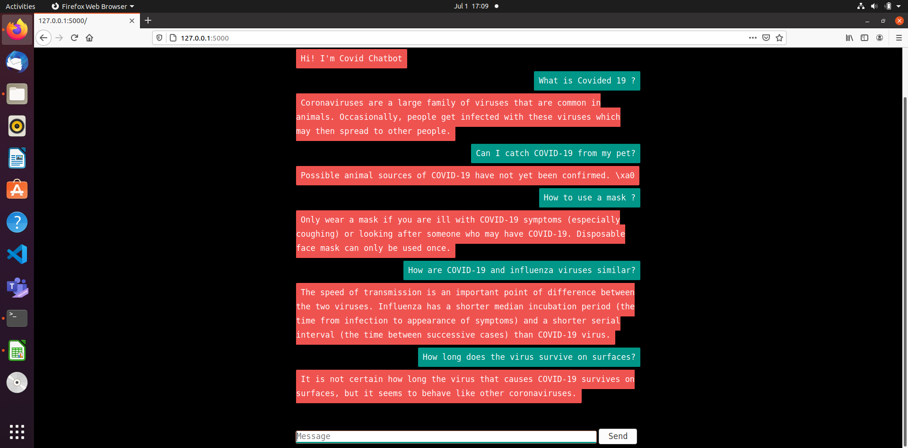

# Covid Q&A Chatbot

## Overview
This is a **Covid Q&A Chatbot** built using **Python Flask**. It utilizes **Google's Universal Sentence Encoder (USE)** to encode a dataset of **question-answer pairs** stored in a CSV file. The chatbot matches user queries to the most relevant answer using **semantic similarity**.

## Features
- Handles **Covid-19 related queries** using a pre-defined FAQ dataset.
- Uses **Universal Sentence Encoder (USE)** for **semantic text matching**.
- Built with **Flask** for a simple web-based API.
- Supports **natural language queries**.

## How It Works
1. The chatbot loads a **CSV file** with two columns: `Context` (questions) and `Answer`.
2. It encodes both the questions and answers using **Universal Sentence Encoder (USE)**.
3. When a user asks a question, it encodes the input and finds the most **semantically similar** question in the dataset.
4. The chatbot returns the corresponding **answer**.

## What is the Universal Sentence Encoder (USE)?
The **Universal Sentence Encoder (USE)** is a **pre-trained deep learning model** from Google that converts sentences into high-dimensional vector representations. These embeddings capture the **semantic meaning** of text, allowing us to measure similarity between sentences effectively.

### Key features of USE:
- Supports **multi-language text embeddings**.
- Optimized for **semantic similarity, text classification, and clustering**.
- Provides **fixed-length vector representations** of sentences, making it easy to compare them mathematically.

More details: [Google's Universal Sentence Encoder](https://tfhub.dev/google/universal-sentence-encoder/4)

---

## Installation
### **1. Clone the repository**
```bash
git clone https://github.com/siddhantBhanot/Covid-Chatbot.git
cd covid-chatbot
```

## 2. Create a Virtual Environment
```bash
python -m venv venv
source venv/bin/activate  # For macOS/Linux
venv\Scripts\activate     # For Windows
```

## 3. Install Dependencies
```bash
pip install -r requirements.txt
```

## 4. Download Universal Sentence Encoder
The model can be downloaded directly when running the app. However, to avoid downloading it each time, you can manually download and store it:

```python
import kagglehub

path = kagglehub.model_download("google/universal-sentence-encoder/tensorFlow2/multilingual-qa")
```

## Running the Application
```bash
python app.py
```

## API Endpoints

### 1. Home Page
```http
GET /
```

### 2. Get Bot Response
```http
GET /get?msg=your_query
```
Example:

```bash
curl "http://127.0.0.1:5000/get?msg=What is coronavirus?"
```

Response:
```json
{
  "response": "Coronaviruses are a large family of viruses which may cause illness in animals or humans."
}
```

## Screenshot
Below is a screenshot of the Covid Chatbot application in action:



